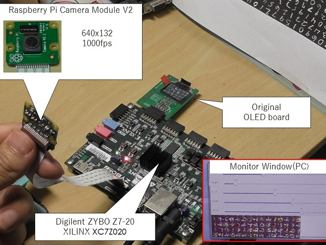
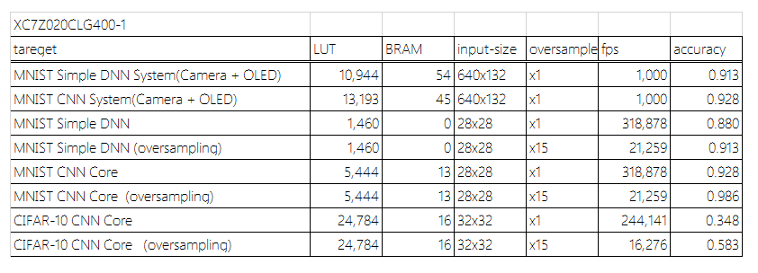


[English version](README_en.md)

# BinaryBrain Version 3<br> --binary neural networks platform for LUT-networks

[詳細なドキュメントはこちら](https://binarybrain.readthedocs.io/ja/latest/)です。

## 概要
BinaryBrain は主に当サイトが研究中の LUT(Look-up Table)-Networkを実験することを目的に作成したディープラーニング用のプラットフォームです。
LUT-Networkの評価を目的に作成しておりますが、それ以外の用途にも利用可能です。

以下の特徴があります

- ニューラルネットのFPGA化をメインターゲットにしている
- バイナリネットであるも関わらず変調技術により回帰分析が可能
- 独自の確率的LUTのモデルにより、高速に学習できる
- 量子化＆疎行列のネットワークでパフォーマンスの良い学習が出来る環境を目指している
- C++で記述されている
- GPU(CUDA)に対応している
- 高速でマニアックな自作レイヤーが作りやすい


## 性能紹介

フルバイナリネットワークで、遅延数ミリ秒(1000fps)での画像認識の例です。




下記のような微小リソース量で動作可能です。



パーセプトロンとは異なる下記のネットワークモデルが利用可能です。
(もちろん従来のパーセプトロンモデルでの)


## MNISTサンプルの動かし方
AXV2以降の命令が使えるCPUと、Windows7以降の環境を想定しております。
CUDA(Kepler以降)にも対応しています。

### windows
1. install VisualStudio 2017 + CUDA 10.1
2. git clone --recursive -b ver3_release https://github.com/ryuz/BinaryBrain.git 
3. download MNIST from http://yann.lecun.com/exdb/mnist/
4. decompress MNIST for "\samples\mnist"
5. open VC++ solution "samples\mnist\sample_mnist.sln"
6. build "x64 Release"
7. run

### Linux(Ubuntu 18.04.1)
1. install tools 
```
% sudo apt update
% sudo apt upgrade
% sudo apt install git
% sudo apt install make
% sudo apt install g++
% # sudo apt install nvidia-cuda-toolkit
% wget http://developer.download.nvidia.com/compute/cuda/10.1/Prod/local_installers/cuda_10.1.243_418.87.00_linux.run
% sudo sh cuda_10.1.243_418.87.00_linux.run
```
2. build and run
```
% git clone --recursive -b ver3_release  https://github.com/ryuz/BinaryBrain.git
% cd BinaryBrain/samples/mnist
% make
% make dl_data
% ./sample-mnist All
```

GPUを使わない場合は make WITH_CUDA=No として下さい。

### Google Colaboratory
nvcc が利用可能な Google Colaboratory でも動作可能なようです。
以下あくまで参考ですが、ランタイムのタイプをGPUに設定した上で
```
!git clone --recursive -b ver3_release  https://github.com/ryuz/BinaryBrain.git
%cd BinaryBrain/samples/mnist
!make all
!make run
```
のような操作で、ビルドして動作させることができます。


### Python (β版)

#### 事前準備
必要なパッケージを事前にインストールください
```
% pip3 install setuptools
% pip3 install pybind11
% pip3 install numpy
% pip3 install tqdm
```

Windows環境の場合、nvccのほかにも VisualStudio の 64bit 版がコマンドラインから利用できるようにしておく必要があります。
例えば以下のように実行しておきます。 x64 の指定が重要です。

```
> "C:\Program Files (x86)\Microsoft Visual Studio\2017\Community\VC\Auxiliary\Build\vcvarsall.bat" x64
```

#### インストール
下記のコマンドでインストール可能です。
```
% # install
% cd python
% python3 setup.py install
```

#### サンプルの実行
```
% # Simple DNN sample
% python3 MnistSparseLutSimple.py

% # CNN sample
% python3 MnistSparseLutCnn.py
```

#### pip によるインストール
いずれ下記のようにインストールできるようになるかもしれません
```
% pip3 install binarybrain
```


### githubからの取得
現在 version3 は下記の branch で管理しています

- ver3_develop 
 著者の開発用。記録のためにビルド不能なものを入れることもあります。
- ver3_release 
 リリース用。基本的な動作確認はしてからここにマージしています。
- master 
 現在は ver3 のリリース版を反映。

tag は 開発都合で ver3_build0001 のような形式で定期的に打っており、特に動作確認などのタイミングでなるべく安定していそうなところで ver3_release1 のような形で打つようにはしています。
まだ、開発速度が早い状況ですので、再現性の確保などで必要な際はタグを活用ください。


## 基本的な使い方
CPU版に関してはヘッダオンリーライブラリとなっているため、include 以下にあるヘッダファイルをインクルードするだけでご利用いただけます。

GPUを使う場合は、ヘッダ読み込みの際に BB_WITH_CUDA マクロを定義した上で、cuda 以下にあるライブラリをビルドした上でリンクする必要があります。

また、BB_WITH_CEREAL マクロを定義すると、途中経過を json 経由で保存可能となります。


## 学習ネットの作り方
順次記述予定ですが、現じてでは基本的にはソースを解読ください。<br>
こちらに手がかり程度に[APIの概要](documents/class.md)を記載しています。


## LUT-Networkとは?

LUT-Networについて説明します。
なお[slideshare](https://www.slideshare.net/ryuz88/lutnetwork-revision2)にも少し資料を置いております。

### デザインフロー
FPGA回路はLUTによって構成されています。
このプラットフォームはLUTを直接学習させます。


### 特徴
ソフトウェアの最適化の技法で入力の組み合わせ全てに対して、計算済みの結果を表にしても持たせてしまうテクニックとして、「テーブル化」と呼ばれるものがあります。
また、バイナリネットワークは各レイヤーの入出力が２値化されています。２値化データは例えば0と1の２種で表せるので、例えば32個の入力を持ち、32個の出力を持つレイヤーの場合、32bitで表現可能な4Gbitのテーブルを32個持てば、その間がどんな計算であろうとテーブル化可能です。
4Gbitでは大きすぎますが、テーブルサイズは入力サイズの2のべき乗となるので、例えばこれが6入力程度の小さなものであれば、テーブルサイズは一気に小さくなり、たった64bitのテーブルに収めることが可能です。
そこで、少ない入力数の単位にネットワークを細分化して、小さいテーブルを沢山用意してネットワークを記述しようと言う試みがLUTネットワークです。LUTはルックアップテーブルの略です。
FPGAではハードウェアの素子としてLUTを大量に保有しており、そのテーブルを書き換えることであらゆる回路を実現しています。特にDeep Learningに利用される大規模FPGAは、現在4～6入力のLUTが主流です。
そこで、入力4～6個のLUT-Networkをディープラーニングの手法で直接学習させることで、GPU向けのネットワークをFPGAに移植するよりも遥かに高い効率で実行できるネットワークが実現可能となります。LUTは単独でXORが表現できるなど、パーセプトロンもモデルよりも高密度な演算が可能です。
また2入力のLUTを定義した場合、これは単なるデジタルLSIの基本ゲート素子そのものなので、ASIC設計に応用できる可能性もあります。

### 従来のバイナリ・ディープ・ニューラル・ネットワークとの違い
従来のバイナリ・ディープ・ニューラル・ネットワークでは、CPU/GPU演算でもっとも課題となる重み係数が2値化されていました。LUTネットワークではこれらは最後にテーブル化されるので学習時はFP32などで計算できます。そして現在、後に述べる確率的LUTモデルによって、バイナリで確率的に多くの回数を試行して求めるべき演算をFP32で極めて効率的に計算することが可能です。
また、重みはFP32で保有したまま、Forwardはバイナリで繰り返しで計算するモデル(micro-MLP)も有しており、その場合は、唯一アクティベーション層でバイナリ化が行われます。


結合数がLUTのテーブルサイズで律速される為、疎結合となりますが、他の点においては、従来相当の学習能力を持った上で、推論に関しては特にFPGA化においては驚異的なパフォーマンスを発揮します。

### バイナリ変調モデル
BinaryBrainではバイナリ変調したデジタル値を扱うことが出来ます。変調を掛けずに普通のバイナリネットワークの学習にBinaryBrainを使うことはもちろん可能ですが、その場合は２値しか扱えないため、回帰分析などの多値のフィッティングが困難になります。
バイナリ変調モデルは下記のとおりです。

特に難しい話ではなくD級アンプ(デジタルアンプ)や、1bit-ADC など、広く使われているバイナリ変調の応用に過ぎません。
昨今のデジタルアンプは内部では2値を扱っているのに、人間の耳に届くときにはアナログの美しい音として聞こえます。
バイナリ変調は、量子化を行う際により高い周波数でオーバーサンプリングすることで、バイナリ信号の中に元の情報を劣化させずに量子化を試みます。バイナリネットワーク自体はそのようなバイナリを前提に学習を行いますが、極めて小さな回路規模で大きな性能を発揮します。
数学的には、元の多値に従った確率で0と1を取る確率変数に変換して扱うと理解いただければよいかと思います。


### 確率的LUTモデル

バイナリ変調された信号は、stochastic演算を活用することが出来ます。
次の図は、stochastic演算の例で、80%の確率で1が現れる入力と50%の確率で1が現れる入力のANDを取ることで40%の確率で1が現れる出力を得ている例です。


たった1個のANDゲートで乗算が可能です。もちろん例えば4bit分の精度の信号を扱うのに15個のバイナリ値を通す必要があるので、必要な精度が増えると効率が悪くなるのですが、比較的低精度の領域においては効率よく演算が可能です。
BinaryBrainではLUT-Networkを学習させるためにバイナリ確率変数を入力として、バイナリ確率変数を出力するLUTのモデルが利用可能です。
確率的LUTモデルは本物のLUTの回路のゲート演算をStochastic演算に置き換えた上で、その内部のLUTテーブルすら確率変数とした場合の出力を求めるように立式しています。
簡単な説明のために、2入力LUT(テーブルサイズ4個)のモデルを以下に示します。


これは、入力をx0-x1の確率変数とし、バイナリ値が1となる確率を実数値(FP32)で入力します。
また、W0-W3はルックアップテーブルの各値を確率値を保表す実数値(FP32)とします。
そうすると

- W0が引かれる確率 : (1- x1) * (1- X0)
- W1が引かれる確率 : (1- x1) * X0
- W2が引かれる確率 : x1 * (1- X0)
- W3が引かれる確率 : x1 * X0

となるので、出力であるyが1となる確率値は、これらにW0-W3の値を乗じたものの和になります。
そしてこの計算ツリーは逆伝播可能であるので、W0-W3を学習させることが出来ます。
結果的に、多値の入力をバイナリ変調するなどで確率的バイナリにした場合に結果を確率的に出力する回路を高パフォーマンスで実現できます。
これは逆伝播を作るための微分が可能であるため、誤差逆伝播による学習が可能で、極めて効率的にテーブルに該当するWパラメータを最適化できます。
Wは実数値を持つため、実際にはLUTテーブルに対応する異なる演算テーブルが確率に応じて重なり合って存在している状態を表すことになります。
また、6入力LUT用の計算式は64個のテーブルを引くために大きなグラフになりますが、同様の考え方で記述できます。

この回路で得られた出力はカウンティングして実数値にすることでLPF(Low Pass Filter)を通したのと同じ効果を得られるため、簡単に回帰問題などにも応用できる上、そのままFPGA化することができます。
もちろん、そのまま普通のバイナリネットワークとして利用することも可能です。

確率的LUTモデルを用いることで、条件が揃えば、後に述べるμMLPのモデルに比べて非常に高速且つ高精度に学習を行うことが可能です。

さて、ここで確率的LUTモデルがそのままでは利用できないケースについて述べます。
stochastic演算の成立条件は２つの入力に相関が無く、確率的に扱える場合のみです。したがって、入力時に相関が無くとも、ネットワーク内で同じ結果に依存して相関を持った入力同士ではうまくいかないケースが出てきます。
そういった場合は、バイナリ列を計算の途中でシャッフルするなどして、相関性を破壊するなどの追加回路が必要となります。


### 確率的LUTモデルから派生した疎結合網学習モデル

相関性を無視して学習を進めるのにもっと簡単な方法もあります。
確率的LUTモデルを確率計算ではなく、単なるパーセプロトンの置き換えとして使ってしまう方法です。
確率的LUTモデルの数式自体は入力数が限定され、疎結合にしか使えないという条件を許容すれば、パーセプロトンと異なり、単独でXORなどを学習できるモデルとして機能することが実験により見えてきました。

目的はLUTの学習ですので、疎結合を前提としています。LUTはXORを表せますが、パーセプロトンは単独でXORを学習できませんので、パーセプロトンでLUTを学習させるとLUTの持っている性能を活かし切れない学習しか出来ません。

このモデルを用いると、非常に効率のいい疎結合網の学習が可能です。
そこにバイナリ活性層を加えると従来のパーセプロトンを使ったネットワーク同様にバイナリネット化することが可能です。
入力数が6などに限定された疎結合バイナリネットワークはそのままLUTにコピー可能ですので、このやり方はFPGAの学習にとても相性が良いです。


### μMLPのアイデア
μMLPは確率的LUTモデルを思いつく前のアイデアで、パーセプトロンのモデルの組み合わせでLUTをモデル化したものです。
１つのLUTは万能素子なのでXORなどの回路を単独の素子で表現可能です。しかし、パーセプトロンは１つではXORの学習は出来ず、隠れ層を持ったネットワーク構成が必要となります。
その関係を以下に示します。


中間層を有したMLP(多層パーセプトロン)は、誤差逆伝播によりXORなどの複雑な論理も学習できることが知られています。そこで、LUTと等価の表現能力を有するバイナリMLPをMicro-MLPと呼ぶことにします。Micro-MLPは最小で4個の中間層を保持すれば、6次のXORを学習できる可能性を持ちますが、実際に実験を行ったところ、16~64個程度の中間層を持つMicro-MLPであれば、局所解に陥る可能性も低いままLUTの表現範囲を広く学習できることが分かってきました。
この Micro-MLP を束ねて作ったレイヤーをさらに多段に重ねることで、従来のDenseAffineに近い学習性能のレイヤーをバイナリで構築可能です。

### μMLPの LUTモデル
確率的LUTのアイデアにより、必要性は大きく低下したのですが、確率値ではなくバイナリ値のまま学習させるMicro-MLPについて説明します。
Micro-MLPはバイナリ値のまま学習させることができるため、必ずしも確率的に値が扱えないケースや、モデルの検証に役立ちます。
バイナリLUTのモデルとそれに対応するMicro-MLPの単位の関係を示します。


学習時のモデルを以下に示します。


出力層にバイナリ活性化を置くことで入出力を全て2値化しますが、内部の演算はすべてFP32などの多値で行います。逆伝播も全て多値で行います。


### LUT-Networkのリソース見積もり

LUT-Networkを扱う上で重要なのは、学習時の演算時間と、推論時のリソースを含めた性能です。
下記に大雑把な机上計算による見積りを示します。


この見積もりは確率的LUTモデルを用いたときのものです。
学習時は、Intel Core-i CPU を前提に計算していますが、Version3 からはGPUにも対応しています。
推論に関してはCPUでもある程度性能の出るインプリは可能と思われますが、特にFPGA化した場合に驚異的な性能を発揮します。


## ライセンス
現在MITライセンスを採用しています。lisense.txtを参照ください。
ただし、本ソースコードは CEREAL を利用しているので、それらに関しては個別に各ライセンスに従ってください。

## 参考
- BinaryConnect: Training Deep Neural Networks with binary weights during propagations<br>
https://arxiv.org/pdf/1511.00363.pdf

- Binarized Neural Networks<br>
https://arxiv.org/abs/1602.02505

- Binarized Neural Networks: Training Deep Neural Networks with Weights and Activations Constrained to +1 or -1<br>
https://arxiv.org/abs/1602.02830

- XNOR-Net: ImageNet Classification Using Binary Convolutional Neural Networks<br>
https://arxiv.org/abs/1603.05279

- Xilinx UltraScale Architecture Configurable Logic Block User Guide<br>
https://japan.xilinx.com/support/documentation/user_guides/ug574-ultrascale-clb.pdf


## 作者情報
渕上 竜司(Ryuji Fuchikami)
- github : https://github.com/ryuz
- blog : http://ryuz.txt-nifty.com
- twitter : https://twitter.com/ryuz88
- facebook : https://www.facebook.com/ryuji.fuchikami
- web-site : http://ryuz.my.coocan.jp/
- e-mail : ryuji.fuchikami@nifty.com

