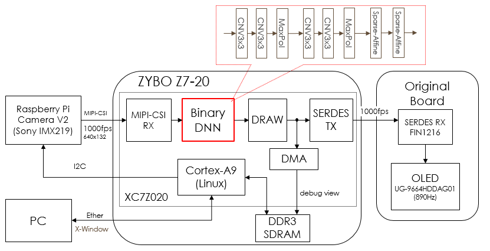
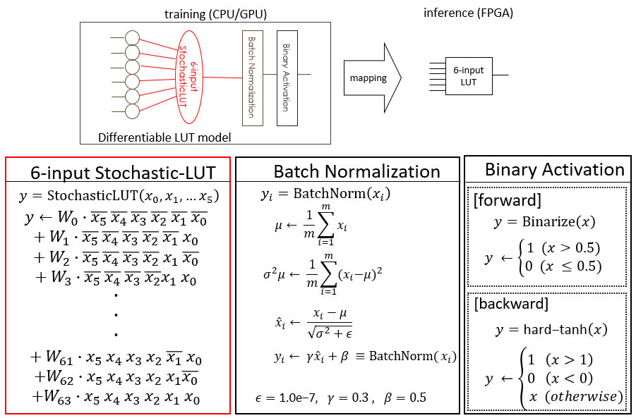


[English version](README_en.md)

# BinaryBrain Version 4<br> --binary neural networks platform for LUT-networks

[詳細なドキュメントはこちら](https://binarybrain.readthedocs.io/ja/ver4_release/) です。


## 概要

BinaryBrain は主に当サイトが研究中の LUT(Look-up Table)-Networkを実験することを目的に作成したディープラーニング用のプラットフォームです。

FPGAのLUTをStochastic計算由来の微分可能回路記述(differentiable circuit description)にて直接的に学習させることで高い密度でのFPGA学習を目指しています。

LUT-Networkの評価を目的に作成しておりますが、それ以外の用途にも利用可能です。

以下の特徴があります

- FPGA回路のDeepLearning学習をメインターゲットにしている
- 微分可能LUTモデルを用いてFPGAの回路素子であるLUTを直接学習できる
- 極めて軽量で低遅延のFPGA用ソース(Verilog)を出力することができる
- バイナリネットであるも関わらずStochastic計算により回帰分析が可能
- Python または C++ でネットの記述と学習ができる
- GPU(CUDA)に対応しており高速に学習できる


## 微分可能回路記述(differentiable circuit description)

デジタル回路は通常では0か1の値しかとらないため、通常であれば微分することはできません。

一方で、入出力を0や1ではなく「1になる確率」としてアナログ的に扱う手法があり、Stochastic計算と呼ばれます。
幸いな事に Neural Network は、学習において多くの対象の尤度を取り扱う為この考え方は相性のよい考え方です。

Stochastic計算を用いると、例えばANDゲートは二つの入力の両方が同時に1になる確率、すなわち確率の乗算器として振舞います。このようにすべてのデジタル回路をStochastic計算に置き換えることが可能です。

FPGAというデバイスは、LUTと呼ばれる小さなメモリとこのメモリを選択する集合体で、メモリを書き換えることでプログラマブルな回路記述を実現します。このLUT回路を微分可能回路記述に置き換えたのちにメモリに相当する部分に学習対象の重み係数を置いて学習を行うネットワークが LUT-Network です。

BinaryBrain は LUT-Network の学習可能性を実証するために作られたプラットフォームです。


## 性能紹介

フルバイナリネットワークで、遅延数ミリ秒(1000fps)での画像認識の例です。





下記のような微小リソース量で動作可能です。


パーセプトロンとは異なる下記のネットワークモデルが利用可能です。
(もちろん従来のパーセプトロンモデルでの)




下記のようなリアルタイムなセマンティックセグメンテーションも実現できています。

[](https://www.youtube.com/watch?v=f78qxm15XYA)


## MNISTサンプルの動かし方(C++)

AXV2以降の命令が使えるCPUと、Windows7以降の環境を想定しております。
CUDA(Kepler以降)にも対応しています。

MNISTのサンプルの使い方は samples/mnist/readme.txt を参照ください。
以下は All オプションで内蔵するサンプルすべてを実行するものです。

### windows

1. install VisualStudio 2022 + CUDA 12.6
2. git clone --recursive https://github.com/ryuz/BinaryBrain.git 
3. download MNIST from http://yann.lecun.com/exdb/mnist/
4. decompress MNIST for "\samples\mnist"
5. open VC++ solution "samples\mnist\sample_mnist.sln"
6. build "x64 Release"
7. run

### Linux(Ubuntu)

1. install CUDA 12.6 

2. build and run

```
% git clone --recursive https://github.com/ryuz/BinaryBrain.git
% cd BinaryBrain/samples/cpp/mnist
% make
% make dl_data
% ./sample-mnist All
```

GPUを使わない場合は make WITH_CUDA=No として下さい。

### Google Colaboratory

nvcc が利用可能な Google Colaboratory でも動作可能なようです。
以下あくまで参考ですが、ランタイムのタイプをGPUに設定した上で
```
!git clone --recursive https://github.com/ryuz/BinaryBrain.git
%cd BinaryBrain/cpp/samples/mnist
!make all
!make run
```
のような操作で、ビルドして動作させることができます。


## MNISTサンプルの動かし方(Python)

作者は現在 Python 3.9 にて開発しています。


### 事前準備

必要なパッケージを事前にインストールください

```
% pip install setuptools
% pip install pybind11
% pip install numpy
% pip install tqdm
```


本サンプルでは PyTorch を使いますので、環境に合わせて [こちら](https://pytorch.org) からインストールしておいてください。

Windows環境の場合、nvccのほかにも VisualStudio の 64bit 版がコマンドラインから利用できるようにしておく必要があります。
例えば以下のように実行しておきます。 x64 の指定が重要です。

```
> "C:\Program Files (x86)\Microsoft Visual Studio\2019\Community\VC\Auxiliary\Build\vcvarsall.bat" x64
```

### インストール(pipを使う場合)

下記のコマンドなどでインストール可能です。

```
% pip install binarybrain
```

### インストール(setup.pyを使う場合)
下記のコマンドなどでインストール可能です。
```
% # install
% cd python
% python setup.py install --user
```

#### サンプルの実行
```
% cd samples/python/mnist

% # Simple DNN sample
% python3 MnistDifferentiableLutSimple.py

% # CNN sample
% python3 MnistDifferentiableLutCnn.py
```


### Google Colaboratory

Google Colaboratory で利用する場合は、ランタイムのタイプを「GPU」にして、下記を実行した後にランタイムの再起動を行えば利用できるようになるはずです。

```
!pip install pybind11
!git clone --recursive https://github.com/ryuz/BinaryBrain.git
%cd BinaryBrain
!python setup.py install --user
```

## githubからの取得

現在 version4 は下記の branch で管理しています

- ver4_develop 
 著者の開発用。記録のためにビルド不能なものを入れることもあります。
- ver4_release 
 リリース用。基本的な動作確認はしてからここにマージしています。
- master 
 現在は ver3 のリリース版を反映。

<!-- 
tag は 開発都合で ver3_build0001 のような形式で定期的に打っており、特に動作確認などのタイミングでなるべく安定していそうなところで ver3_release1 のような形で打つようにはしています。
まだ、開発速度が早い状況ですので、再現性の確保などで必要な際はタグを活用ください。
-->

## 基本的な使い方

CPU版に関してはヘッダオンリーライブラリとなっているため、include 以下にあるヘッダファイルをインクルードするだけでご利用いただけます。

GPUを使う場合は、ヘッダ読み込みの際に BB_WITH_CUDA マクロを定義した上で、cuda 以下にあるライブラリをビルドした上でリンクする必要があります。

また、BB_WITH_CEREAL マクロを定義すると、途中経過を json 経由で保存可能となります。


## LUT-Networkとは?

LUT-Networについて説明します。


### デザインフロー

FPGA回路はLUTによって構成されています。
このプラットフォームはLUTを直接学習させます。


### 特徴

ソフトウェアの最適化の技法で入力の組み合わせ全てに対して、計算済みの結果を表にしても持たせてしまうテクニックとして、「テーブル化」と呼ばれるものがあります。
また、バイナリネットワークは各レイヤーの入出力が２値化されています。２値化データは例えば0と1の２種で表せるので、例えば32個の入力を持ち、32個の出力を持つレイヤーの場合、32bitで表現可能な4Gbitのテーブルを32個持てば、その間がどんな計算であろうとテーブル化可能です。
4Gbitでは大きすぎますが、テーブルサイズは入力サイズの2のべき乗となるので、例えばこれが6入力程度の小さなものであれば、テーブルサイズは一気に小さくなり、たった64bitのテーブルに収めることが可能です。
そこで、少ない入力数の単位にネットワークを細分化して、小さいテーブルを沢山用意してネットワークを記述しようと言う試みがLUTネットワークです。LUTはルックアップテーブルの略です。
FPGAではハードウェアの素子としてLUTを大量に保有しており、そのテーブルを書き換えることであらゆる回路を実現しています。特にDeep Learningに利用される大規模FPGAは、現在4～6入力のLUTが主流です。

ここで「テーブルを引く」という概念を微分して逆伝搬で学習さえるというと不思議に思う方もおられるかもしれません。

しかしながらテーブルを引くという行為は回路的にはメモリをマルチプレクサで選択しているのみです。

デジタル回路は AND や OR などの論理回路ですが、これらは Stochastic演算に当てはめると乗算などの一般的な計算に帰着可能です。

Stochastic演算を行う為には演算対象が確率的なものでなければなりませんが、DeepLearningで扱っている値は
そもそも「もっともらしさ(尤度)」であって、バイナリ化したからと言って失われるものではありません。

BinaryBrain では 入力4～6個のLUT を使った Network を逆伝搬によって直接学習させることで、GPU向けのネットワークをFPGAに移植するよりも遥かに高い効率で実行できるネットワークが実現可能となります。LUTは単独でXORが表現できるなど、パーセプトロンもモデルよりも高密度な演算が可能です。
また2入力のLUTを定義した場合、これは単なるデジタルLSIの基本ゲート素子そのものなので、ASIC設計に応用できる可能性もあります。

結合数がLUTのテーブルサイズで律速される為、疎結合となりますが、他の点においては、従来相当の学習能力を持った上で、推論に関しては特にFPGA化においては高いパフォーマンスを発揮します。


### バイナリ変調モデル

BinaryBrainではバイナリ変調したデジタル値を扱うことが出来ます。変調を掛けずに普通のバイナリネットワークの学習にBinaryBrainを使うことはもちろん可能ですが、その場合は２値しか扱えないため、回帰分析などの多値のフィッティングが困難になります。
バイナリ変調モデルは下記のとおりです。


特に難しい話ではなくD級アンプ(デジタルアンプ)や、1bit-ADC など、広く使われているバイナリ変調の応用に過ぎません。
昨今のデジタルアンプは内部では2値を扱っているのに、人間の耳に届くときにはアナログの美しい音として聞こえます。

バイナリ変調は、量子化を行う際により高い周波数でオーバーサンプリングすることで、バイナリ信号の中に元の情報を劣化させずに量子化を試みます。バイナリネットワーク自体はそのようなバイナリを前提に学習を行いますが、極めて小さな回路規模で大きな性能を発揮します。
これは、元の多値に従った確率で0と1を取る確率変数に変換して扱うという概念であり、Stochastic性を与えていると理解いただければよいかと思います。


## ライセンス

現在MITライセンスを採用しています。lisense.txtを参照ください。


## fpgax #11 ＋ TFUG ハード部：DNN専用ハードについて語る会(2019/02/02) にて発表させて頂きました

https://fpgax.connpass.com/event/115446/

## ICCE2019(Berlin)にて発表させて頂きました

[@FIssiki](https://twitter.com/fissiki)様の多大なるご協力のもと、ICCE2019(Berlin)にて発表しております。

2019 IEEE 9th International Conference on Consumer Electronics (ICCE-Berlin) 
<[slide](https://www.slideshare.net/ryuz88/fast-and-lightweight-binarized-neural-network-implemented-in-an-fpga-using-lutbased-signal-processing-and-its-timedomain-extension-for-multibit-processing)> <[pdf](https://edas.info/p25749#S1569571697)>

https://ieeexplore.ieee.org/document/8966187 


## 作者情報

渕上 竜司(Ryuji Fuchikami)

- e-mail : ryuji.fuchikami@nifty.com
- github : https://github.com/ryuz
- web-site : http://ryuz.my.coocan.jp/
- tech-blog : https://ryuz.hatenablog.com/
- blog : http://ryuz.txt-nifty.com
- twitter : https://twitter.com/ryuz88
- facebook : https://www.facebook.com/ryuji.fuchikami


## 参考にさせて頂いた情報

- バイナリニューラルネットとハードウェアの関係<br>
 https://www.slideshare.net/kentotajiri/ss-77136469

- BinaryConnect: Training Deep Neural Networks with binary weights during propagations<br>
https://arxiv.org/pdf/1511.00363.pdf

- Binarized Neural Networks<br>
https://arxiv.org/abs/1602.02505

- Binarized Neural Networks: Training Deep Neural Networks with Weights and Activations Constrained to +1 or -1<br>
https://arxiv.org/abs/1602.02830

- XNOR-Net: ImageNet Classification Using Binary Convolutional Neural Networks<br>
https://arxiv.org/abs/1603.05279

- Xilinx UltraScale Architecture Configurable Logic Block User Guide<br>
https://japan.xilinx.com/support/documentation/user_guides/ug574-ultrascale-clb.pdf

